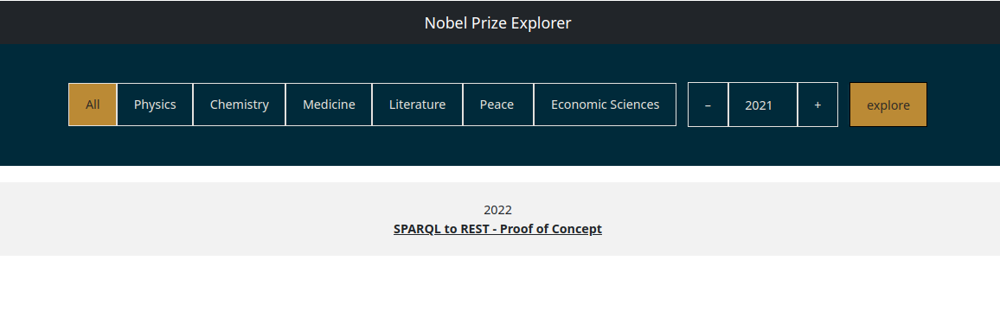

# SPARQL to REST

<details>
<summary> <b> Introdução </b> </summary>
<p>

Este projeto visa desenvolver uma prova de conceito (PoC) para exposição dos dados (triplas RDF) de um endpoint SPARQL por meio de um endpoint RESTful através do projeto [RAMOSE](https://github.com/opencitations/ramose).

O projeto RAMOSE permite o desenvolvimento ágil de APIs RESTful na linguagem Python através do framework [Flask](https://github.com/pallets/flask). Através de routing podemos mapear requisições HTTP para execução de uma query SPARQL pré-definida.

O mapeamento de URLs para as queries é realizado através de um arquivo de configuração em formato de texto. Alguns exemplos estão disponíveis [neste repositório](https://github.com/opencitations/api) da organização OpenCitations.

Além de proporcionar o acesso massivo à triplestores sem a curva de aprendizado da web semântica, é possível definir múltiplas APIs a partir de múltiplos endpoints SPARQL, permitindo integração entre diversos sistemas. O artigo base do projeto está disponível no [Semantic Web Journal](http://www.semantic-web-journal.net/content/creating-restful-apis-over-sparql-endpoints-using-ramose-0).

Para ilustrar a conversão, foi utilizado o seguinte endpoint SPARQL:

- Wikidata: https://query.wikidata.org/

</p>
</details>


<details>
<summary> <b> Instalação </b> </summary>
<p>

O primeiro passo é clonar o repositório:

```sh
git clone --recurse-submodules https://github.com/gabrielchristo/sparql-to-rest.git
```

### Backend RAMOSE

Para executar o backend RAMOSE leia os detalhes de execução [aqui](https://github.com/gabrielchristo/sparql-to-rest/blob/main/api/README.md). Com o backend iniciado deve ser possível acessar a API por:

```
http://localhost:5050/api/
```

e observar a seguinte tela:


### GUI

Para executar a interface gráfica leia os detalhes de execução [aqui](https://github.com/gabrielchristo/sparql-to-rest/blob/main/gui/README.md). Com o backend e a GUI iniciados deve ser possível acessar a mesma por:

```
http://localhost:4200
```

e observar a seguinte tela:



Com isso já é possível navegar pelas premiações de acordo com categoria e ano:


</p>
</details>


<details>
<summary> <b> Consultas </b> </summary>
<p>

Para realizar as consultas na Wikidata foi necessário ter conhecimento de algumas propriedades e entidades relacionadas com o domínio do trabalho. Neste caso foi escolhido o `Prêmio Nobel` como tópico para realização da prova de conceito.

| Propriedade | Descrição       |
|-------------|-----------------|
| P18         | image           |
| P31         | instance of     |
| P50         | author          |
| P166        | award received  |
| P279        | subclass of     |
| P585        | point in time   |
| P1411       | nominated for   |
| P1706       | together with   |
| P2121       | prize money     |
| P6208       | award rationale |

| Entidade | Descrição         |
|----------|-------------------|
| Q7191    | nobel prize       |
| Q38104   | physics           |
| Q35637   | peace             |
| Q37922   | literature        |
| Q44585   | chemistry         |
| Q80061   | medicine          |
| Q47170   | economic sciences |

---

Com o vocabulário RDF em mãos, foram definidas duas queries para o RAMOSE:

Query para obter premiados por categoria

```sparql
SELECT DISTINCT ?PersonLabel ?NPLabel (YEAR(?When) as ?Year) ?Picture ?Money ?Motivation
WHERE {
  VALUES ?Category { [[categoryParameter]] }

  ?Person p:P166 ?NobelPrize .
  ?NobelPrize ps:P166/wdt:P279* ?Category ;
              ps:P166/rdfs:label ?NPLabel filter (lang(?NPLabel) = "en") .
  OPTIONAL { ?NobelPrize pq:P585 ?When . }
  OPTIONAL { ?Person wdt:P18 ?Picture . }
  OPTIONAL { ?NobelPrize pq:P2121 ?MoneyValue . }
  BIND(CONCAT(STR(?MoneyValue), " Swedish krona") as ?Money)
  OPTIONAL { ?NobelPrize pq:P6208 ?Motivation filter (lang(?Motivation) = "en") . }
  SERVICE wikibase:label {
    bd:serviceParam wikibase:language "[AUTO_LANGUAGE],en" .
  }
} ORDER BY ?Year
```

Query para obter premiados por categoria e ano

```sparql
SELECT DISTINCT ?PersonLabel ?NPLabel ?Year ?Picture ?Money ?Motivation
WHERE {
  VALUES ?Year { [[yearParameter]] }
  VALUES ?Category { [[categoryParameter]] }
  
  ?Person p:P166 ?NobelPrize .
  ?NobelPrize ps:P166/wdt:P279* ?Category ;
              ps:P166/rdfs:label ?NPLabel ;
              pq:P585 ?When ;
              filter (lang(?NPLabel) = "en" && YEAR(?When) = ?Year) .
  OPTIONAL { ?Person wdt:P18 ?Picture . }
  OPTIONAL { ?NobelPrize pq:P2121 ?MoneyValue . }
  BIND(CONCAT(STR(?MoneyValue), " Swedish krona") as ?Money)
  OPTIONAL { ?NobelPrize pq:P6208 ?Motivation filter (lang(?Motivation) = "en") . }
  SERVICE wikibase:label {
    bd:serviceParam wikibase:language "[AUTO_LANGUAGE],en" .
  }
} ORDER BY ?Motivation
```

</p>
</details>


<details>
<summary> <b> Comparativo com JSON-LD </b> </summary>
<p>

Enquanto o [JSON-LD](https://json-ld.org/spec/latest/json-ld/) (JavaScript Object Notation for Linked Data) busca manter a semântica de triplas (Linked Data) e um objeto `context` para facilitar uma posterior conversão em modelos RDF, o projeto RAMOSE optou por retornar os dados em JSON com formatação livre.

É possível retornar somente as propriedades desejadas de uma query, a partir de modificações no atributo `field_type` do arquivo de configuração. Também é possível aplicar filtros de pré-processamento e pós-processamento no retorno da query SPARQL. Essa liberdade para modelagem da API pode ser benéfica para fins de manutenção e criação de uma especificação [OpenAPI](https://github.com/OAI/OpenAPI-Specification). 

</p>
</details>
